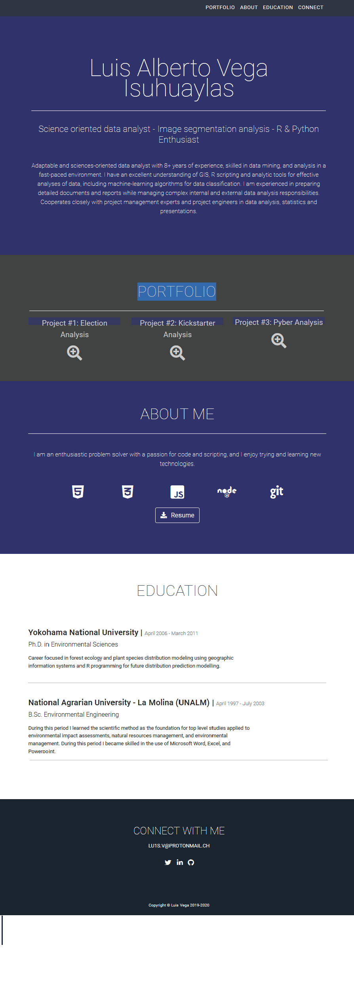

 
 # Portfolio
 
 The following image is a screenshot of my portfolio:
 
 
 
 --------------------------

# Web_Scraping for Mission to Mars web project

A web application is built in this repository for scraping data from four different websites to gather data and display the information in a single HTML page.
The following is a small summary of the components of this assignment:

 MongoDB component:
 - A new database was created, and all of the scraped data was stored in it.
 - Root route / that will query the database and pass the mars data into an HTML template.

Scraping script component:
- https://mars.nasa.gov/news/ : latest news on Mars mission using BeautifulSoup, splinter, pandas in a jupyter notebook.
- https://www.jpl.nasa.gov/spaceimages/?search=&category=Mars : featured image of mars in full resolution.
- https://space-facts.com/mars/ : facts table about Mars
- https://2u-data-curriculum-team.s3.amazonaws.com/dataviz-online-content/module_10/Astropedia+Search+Results+_+USGS+Astrogeology+Science+Center.htm to get the images of 4 hemispheres of Mars

Flask component:
- A python script to run all of the scraping code was designed and all of the scraped data was put into one Python dictionary.
- '/scrape' route which will import the Python script and call the scrape function was created.

 HTML index file:
 - A HTML file called 'index.html' displays all of the data in HTML elements using Bootstrap
